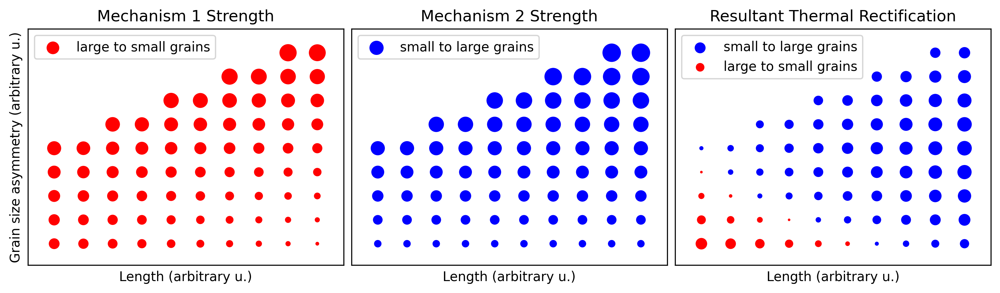

Please Cite:

Lahkar, S., & Ranganathan, R. (2023). Competing mechanisms govern the thermal rectification behavior in semi-stochastic polycrystalline graphene with graded grain-size distribution. Carbon, 118638.

Report any bugs/issues to simantalahkar@hotmail.com / s.lahkar@tue.nl

# Graded-Polygraphene-Thermal-Rectification-Competing-Mechanisms

This repository contains sample LAMMPS simulation script to generate carry out NEMD conductivity simulations on periodic atomistic graded grain density graphene models and generate the Dynamical matrix useful for phonon calculations, along with the associated Python analysis scripts that uses the outputs from LAMMPS simulation as well as from the "PHANA" package developed by Prof. Lingti Kong (github repository at lingtikong/phana). 

After running the LAMMPS simulation using the structure and map files created using the latgen tool (input script: in.lammps):

1. Use the phana package to calculate the eigenvectors and eigenvalues from the dynamical matrix obtained from the simulation (eigenvec.dat). The simulation parameters have been optimized for accuracy of phonon calculation and computational efficiency.

2. Run the spatial_phonon_data.py Python script to obtain the necessary information about atomic contributions to propagating phonons and participation ratios in the form of raw data.

3. Run the interprete_phonon_data.py for subsequent postprocessing of the raw data to obtain the participation ratio plots, along with other useful information on the spatial energy density required.

4. Copy and replace the contents of the generated spatial_data*.custom file into the eqlbm*.custom file generated from the LAMMPS simulation and rename the property columns appropriately (a typical final file is also shared for reference), which can be easily viewed and analyzed in tools like Ovito.

5. Use the nemd.py to calculate the thermal conductivity using the temperature profile-data and the energy exchange-data generated from the simulations, which also creates different plots for monitoring and assessing the system properties throughout the simulation. 
